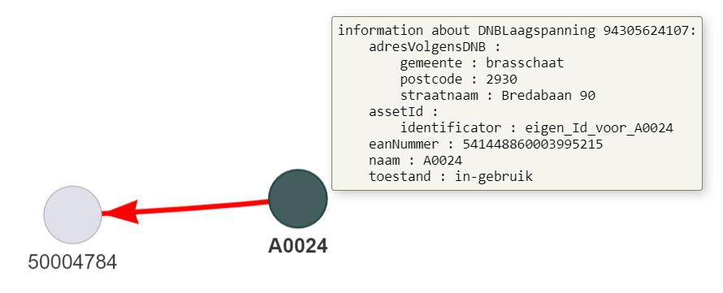

# OTLClassPython Project 
This project aims to implement the Flemish data standard OTL (https://wegenenverkeer.data.vlaanderen.be/) in Python.
Below is sample code that should be self-explanatory. It demonstrates the basic possibilities of this project.

## Installation and requirements
To install the OTL MOW project into your python project, use pip to install it:
``` 
pip install OTLMOW
```
To upgrade an existing installation use:
``` 
pip install OTLMOW --upgrade
``` 
OTLMOW has dependencies on rdflib and pyvis but these are automatically handled by pip.

## Creating the OTL datamodel using the OTL SQLite
With every OTL update, this piece of code will allow the creation of an updated Python datamodel. The generated classes are not backwards compatible.
```
from src.OTLMOW.Facility.OTLFacility import OTLFacility

# create the main facade class: OTLFacility
otl_facility = OTLFacility(logfile=r'C:\temp\pythonLogging\python_log.txt',
                           settings_path="C:\\resources\\settings_OTLMOW.json")

# create a datamodel based on the OTL SQLite database and ttl files stored on the github
otl_file_location = '../InputFiles/OTL 2.4.db'
GA_file_location = '../InputFiles/Geometrie_Artefact_2.4.db'
otl_facility.create_otl_datamodel(otl_sqlite_file_location=otl_file_location,
                                  geo_artefact_sqlite_file_location=GA_file_location)
```
## Using the OTL Datamodel instances to create objects and encode them in JSON
The datamodel generates classes, allowing the properties to be filled with data.
```  
from datetime import datetime
from src.OTLMOW.Facility.OTLFacility import OTLFacility
from src.OTLMOW.OTLModel.Classes.DNBLaagspanning import DNBLaagspanning
from src.OTLMOW.OTLModel.Classes.EnergiemeterDNB import EnergiemeterDNB
from src.OTLMOW.OTLModel.Classes.Voedt import Voedt

# create the main facade class: OTLFacility
otl_facility = OTLFacility(logfile=r'C:\temp\pythonLogging\python_log.txt',
                           settings_path="C:\\resources\\settings_OTLMOW.json")

# use the generated datamodel to create instances of OTL classes
dnb = DNBLaagspanning()
dnb.naam = 'A0024'
dnb.toestand = 'in-gebruik'
dnb.assetId.identificator = 'eigen_Id_voor_A0024'
dnb.eanNummer = '541448860003995215'
dnb.adresVolgensDNB.gemeente = 'brasschaat'
dnb.adresVolgensDNB.postcode = '2930'
dnb.adresVolgensDNB.straatnaam = 'Bredabaan 90'
# dnb.toestand = 'foute toestand'  # wouls raise ValueError because the value is not valid

meter = EnergiemeterDNB()
meter.naam = '50004784'
meter.assetId.identificator = 'eigen_Id_voor_50004784'
meter.aantalTelwerken = 1
meter.geometry = 'POINT Z (157696.6 219065.5 0)'

voedingsrelatie = Voedt()
voedingsrelatie.assetId.identificator = "A0024-50004784"
voedingsrelatie.bronAssetId.identificator = 'eigen_Id_voor_A0024'
voedingsrelatie.doelAssetId.identificator = 'eigen_Id_voor_50004784'

lijst_otl_objecten = [dnb, meter, voedingsrelatie]

# encode to a json representation
encoded_json = otl_facility.encoder.encode(lijst_otl_objecten)
print(encoded_json)

# write the json file
path = f'{datetime.now().strftime("%Y%m%d%H%M%S")}_export.json'
otl_facility.create_file_from_assets(filepath=path, list_of_objects=objects)
```
output:
```
[
    {
        "adresVolgensDNB": {
            "gemeente": "brasschaat",
            "postcode": "2930",
            "straatnaam": "Bredabaan 90"
        },
        "assetId": {
            "identificator": "eigen_Id_voor_A0024"
        },
        "eanNummer": "541448860003995215",
        "naam": "A0024",
        "toestand": "in-gebruik",
        "typeURI": "https://wegenenverkeer.data.vlaanderen.be/ns/onderdeel#DNBLaagspanning"
    },
    {
        "aantalTelwerken": 1,
        "assetId": {
            "identificator": "eigen_Id_voor_50004784"
        },
        "geometry": "POINT Z (157696.6 219065.5 0)",
        "naam": "50004784",
        "typeURI": "https://wegenenverkeer.data.vlaanderen.be/ns/onderdeel#EnergiemeterDNB"
    },
    {
        "assetId": {
            "identificator": "A0024-50004784"
        },
        "bronAssetId": {
            "identificator": "eigen_Id_voor_A0024"
        },
        "doelAssetId": {
            "identificator": "eigen_Id_voor_50004784"
        },
        "typeURI": "https://wegenenverkeer.data.vlaanderen.be/ns/onderdeel#Voedt"
    }
]
```
## Making a visualisation
It is possible to visualise assets in a node diagram.
Simply pass the list of assets (incl. relations) to the visualiser class in the OTL Facility class to create an html file that can be opened in any web browser.
Hovering the nodes will show the data of the assets.
```
otl_facility.visualiser.show(lijst_otl_objecten)
```
The above example will result in the following visualisation:
